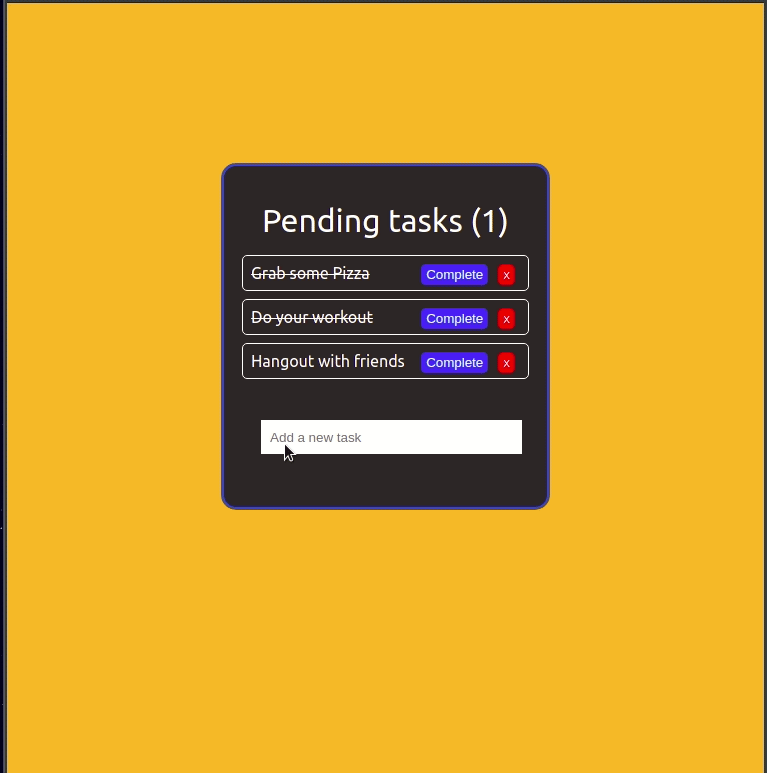

<p align="center">
  
</p>

## <a name='TOC'>🐼 Summary</a>

* [Rules](#rules)
* [Overview](#overview)
* [Api](#api)
* [Åpplication](#application)
* [Bonus](#bonus)
* [Credits](#credits)

## <a name='overview'>🦊 Rules</a>

Hi, here are some rules to carry out this project;

* You **MUST** create a git repository named `cross-2d0`
* You **MUST** create a file called `.author.json` with fullnames of your teams.

```sh
~/ts-baratie ❯❯❯ cat -e .author.json
{
  "fullname" : "John H. Conway",
  "fullname" : "Michael Jackson"
}$
```

> Of course, you can talk about the subject with other developers, peer-learning is
> the key to be a better developer. Don't hesitate to ask questions or help people on slack.

> Don't forget, there is no useless question :-)

You **MUST** return the project on Thursday March, 18 at 12:00 pm by sending an MP on Teams with the link of your github repo.<br />

Your repository **MUST** contain the totality of your source files, but no useless files (node_modules, temp files, log files,...).

## <a name='overview'>🐱 Overview</a>

The purpose of this project is simple, you **MUST** create a 2d0 list using React Native ! ✨<br />

We all have a lot of tasks todo everyday, we don't know how to remember everything ;<br />
You are going to build a full application (server + client) that will solve this pain :)

## <a name='api'>🐨 API</a>

### = Prelude

You **MUST** create a full Node.js server with a database connection using [**Prisma**](https://www.prisma.io) ;<br />
We are going to have 2 models : 

- User

| Field | Type |
|-------|------|
| id | Int| 
| email | String |
| encryptedPassword  | String |
| firstname | String |
| lastname  | String |
| birthdate | DateTime |
| gender | Gender|
| createdAt | DateTime |
| updatedAt | DateTime |
------------------

- Task

| Field | Type |
|-------|------|
| id | Int| 
| content | String |
| isComplete | Boolean |
| userId | Int |
| createdAt | DateTime |
| updatedAt | DateTime |
------------------

### = Feature

A user can `register` and `login` to the application.<br />
Then he can see a `profile` Page that will display his information.<br />
Finally he can of course `create`, `remove` or `set to complete` a new task.

## <a name='application'>🦁 Application</a>

### = Product

Now that you have all server features, ... well just develop it on your mobile application using the style you want :)

A simple example of what we expect :

[]

### = Knowledge

You **MUST** use only react functional componenent and any hooks you want.

> How can we store a authenticated user on an application ?

## <a name='bonus'>🦄 Bonus</a>

I know you love that, well you can in bulk:

* Adding any new features :)
* Add a web version
* Add realtime collaboration task edit feature (hello websocket)

## <a name='credits'>🐵 Credits</a>

Craft with :heart: in **Paris**.
